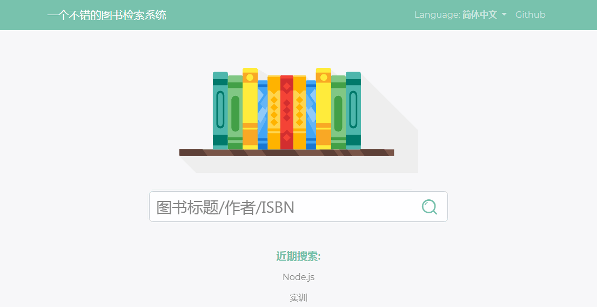
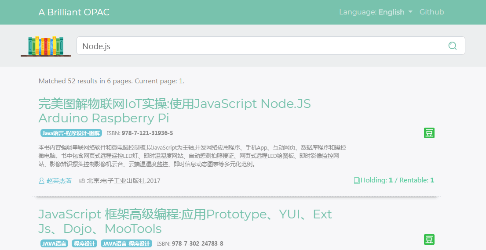

# Library System Frontend (Curriculum Design)

An OPAC (library query system) for curriculum design.   
一个为了交作业而制作的图书查询系统.

## Screenshots




## Development

### Overview

Relative knowledge:   
相关知识:

- HTML/Javascript/CSS
- Sass
- **Bootstrap/JQuery**
- **React**

### Some Commands

``` bash
	# Firstly, ensure you installed Node.js development environment.
	# 首先, 确认你已经安装Node.js开发环境
	node --version;
	# Secondly, install dependencies. 然后安装相关依赖包
	npm install;

	# How to build front-end codes. 如何构建前端页面的代码呢?
	npm run build-dev-live;
	# OR: npm run build-dev
	# OR: npm run build-prod-live
	# OR: npm run build-prod
```

### Implement Search API

实现图书查询的API

Default API is from mock data (`./dist/mock/**.json`) for development mode,
and `/api/search?query=&page=` under same domain for production mode.

开发模式的默认的API是来自模拟数据文件 (`./dist/mock/**.json`).
产品模式下的默认API是同一个域下的 `/api/search?query=&page=`.

- Request: `GET /api/search?query={QUERY_KEYWORD}&page={PAGE_NO}`
	- `{PAGE_NO}` is a number from 1
- Response: refer files `./dist/mock/**.json`

## License

[GPLv3](LICENSE)

## Author

[LiuYue @hanxingliu](https://github.com/hangxingliu)
